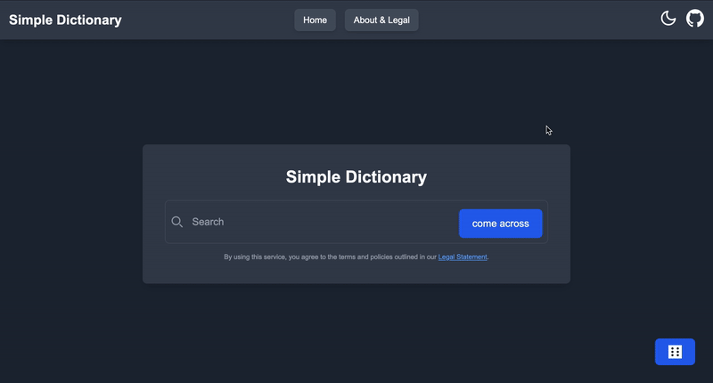

# [Simple Dictionary](https://simple-dictionary-mu.vercel.app/)

Simple Dictionary is a [NextJS](https://nextjs.org/)-based dictionary app that provides users with a fast search algorithm to access definitions. It uses [Free Dictionary API](https://dictionaryapi.dev/) and the [Wiktionary API](https://en.wiktionary.org/api/) to get the corresponding definitions, pronunciation, synonyms, antonyms, and examples of the word. Built for [High Seas 2024-2025](https://highseas.hackclub.com/) by [Hack Club](https://hackclub.com/). 

The app is hosted on [Vercel](https://vercel.com/) and can be accessed at:
[https://simple-dictionary-mu.vercel.app/](https://simple-dictionary-mu.vercel.app/)
> An optional `/?w=\<word\>` query parameter can be used to pre-fill the search bar with a word.



### Lighthouse Scores

| Category       | Score                  |
|----------------|------------------------|
| Performance    | **100**                |
| Accessibility  | **100** *(dark mode)* / **96** *(light mode)* |
| Best Practices | **100**                |
| SEO            | **100**                |

### Disclaimer!
Not all information is guaranteed to be accurate! Please verify the information from a reliable source before using it for any important purposes. Although the information is sourced from reliable sources, data parsing and processing may lead to inaccuracies.

## Quick Features
- **Fast Autocomplete**: Quick autocomplete suggestions are provided using over 500 thousand words in separated text files for fast and accurate search results.
- **Dark Mode**: Dark mode can be toggled in the top right corner.
- **Random Word**: A random word can be generated by clicking the dice icon.
- **Easy Navigation**: The UI is designed to be simple and easy to use with a clean interface.
- **Information Dense**: As much information as possible is provided for each word, while still maintaining a clean and simple design.

##### Simple Dictionary has not been tested on mobile devices and may not work as intended. It is recommended to use a desktop or laptop for the best experience.

## Local Development
### Requirements
- [NextJS](https://nextjs.org/)
- [npm](https://www.npmjs.com/)
- (optional) [Git](https://git-scm.com/)

### Usage
1. Clone the repository
2. Install dependencies
```bash
npm install
```
3. Run the development server
```bash
npm run dev
```
4. Open [http://localhost:3000](http://localhost:3000) in your browser

## Important Notes
- Please see the [About & Legal page](https://simple-dictionary-mu.vercel.app/info) for more detailed information about sources, algorithms and legal information.
- Note that Simple Dictionary is not affiliated with any of the sources used and does not claim ownership of any of the data provided.